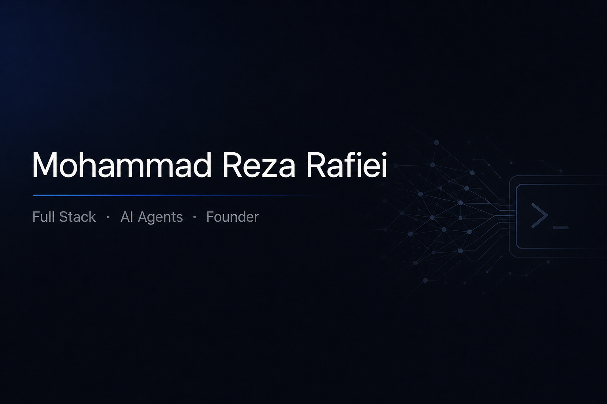

<<<<<<< HEAD

  
   
  

  <h1>Mohammad Reza Rafiei</h1>
  
Full Stack · AI (Agents) · Startup Founder

  

    
    
    
    
  

  

    <a href="https://github.com/mhmdreza-rafiei">GitHub</a>
    ·
    <a href="https://www.npmjs.com/~mhmdreza-rafiei">npm</a>
    ·
    <a href="https://link.me/@mhmdreza_rafiei">link.me</a>
  

## About

I build products and infrastructure around coding agents. My public work is the installer and the catalog that let teams package skills, rules, and agents once and run them in Cursor, Claude Code, Codex, OpenCode, and 70+ other tools.

## What I work on

**[agentry](https://github.com/mhmdreza-rafiei/agentry)** — CLI to install agents, skills, rules, scripts, and profiles from any Git repo into coding agents.

**[agent-tools](https://github.com/mhmdreza-rafiei/agent-tools)** — Catalog of reusable agent artifacts, installable via agentry.

## Topics

`AI agents` · `full stack` · `developer tools` · `CLI` · `TypeScript` · `open source`

## Stack

## GitHub

 

=======
## Hi there 👋

<!--
**mhmdreza-rafiei/mhmdreza-rafiei** is a ✨ _special_ ✨ repository because its `README.md` (this file) appears on your GitHub profile.

Here are some ideas to get you started:

- 🔭 I’m currently working on ...
- 🌱 I’m currently learning ...
- 👯 I’m looking to collaborate on ...
- 🤔 I’m looking for help with ...
- 💬 Ask me about ...
- 📫 How to reach me: ...
- 😄 Pronouns: ...
- ⚡ Fun fact: ...
-->
>>>>>>> a51d1763740a71ed6c30e97407203128322077b5
